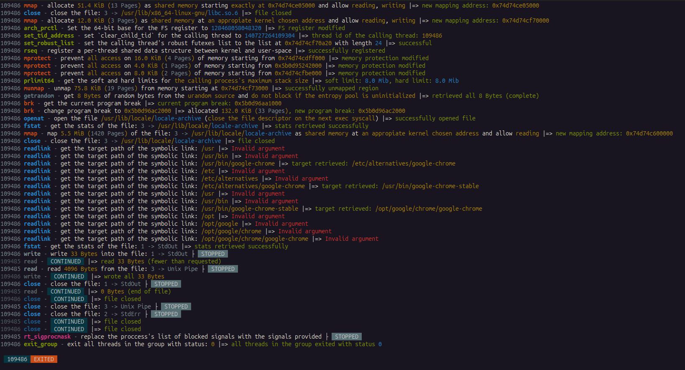

<p align="center">
  
</p>

# About

intentrace is a strace for everyone, intentrace works similarly to strace in that it intercepts and records system calls when a process issues them, it then reasons through these syscalls by consulting an enormous backlog of syscall deduction heuristics.
Due to the fact that linux syscalls almost always have dual usage that's obfuscated by libraries, seeing what a syscall is exactly asking for is immensely useful when e.g. a programmer is debugging a crashing binary.
<p align="center">
  
</p>


Intentrace follows a similar working methodology to the one employed by the [UniKraft kernel](https://github.com/unikraft) in that it attempts to cover a high percentage of the most popular linux software despite supporting only around 166 syscalls out of the 380+ linux syscalls (see page 8 of the Unikraft Paper for an example of strategic syscall coverage: https://arxiv.org/pdf/2104.12721). It's planned eventually for intentrace to cover all linux syscalls.


## Usage

#### to quickly see how intentrace works in action, you can run simple examples

`intentrace ls`

`intentrace google-chrome`

#### to disable program output from cluttering the syscall feed add `-q`

`intentrace -q ls`

#### to include the child processes of multi-threaded programs add `-f`

`intentrace -f docker run alpine`


| Parameter      | Description                       | Default value |
|----------------|-----------------------------------|---------------|
| -c<br/>--summary | provide a summary table at the end of tracing | `false`       |
| -p `pid`<br/>--attach `pid` | attach to an already running proceess | `not enabled`       |
| -f<br/>--follow-forks   | trace child process when traced programs create them | `false`       |
| -z<br/>--failed-only   | only print failed syscalls | `false`       |
| -q<br/>--mute-stdout   | mute traced program's std output | `false`       |


## Installation

### Build from source

Prerequisites:

* Latest stable version of [Rust](https://www.rust-lang.org/tools/install) and Cargo.


Build and run intentrace:

```
git clone https://github.com/sectordistrict/intentrace.git
cd intentrace
cargo build --release
```


### Install from crates.io:

```
cargo install intentrace
```


### Package Manager Availability

[](https://repology.org/project/intentrace/versions)


## Project status

intentrace is currently in beta, currently multi-threaded programs are a hit and miss.

intentrace was originally intended to be a 2 window TUI, where a top panel shows a normal stream of syscalls, and a bottom panel contains metadata and clarifications, but this was abandoned in favor of the current scheme.

#### Supported architecture

intentrace currently only supports `x86-64`, given that the program is currently in beta, PRs for cross compatibility will unfortunately not be accepted until the program is stable enough.


## Contributing

Support intentrace by contributing issues and PRs, don't feel discouraged from filing issues or creating PRs. Reading the source is a great way to learn how linux works.

Feel free to file Issues and open Pull Requests that tackle any of:
- providing more optimal phrasing/wording.
- suggestions for granularity.
- suggestions for fixes.
- etc.. there are no rules, feel free to contribute as you see fit.
